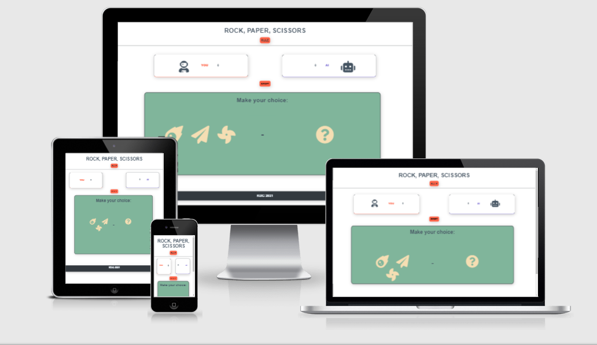
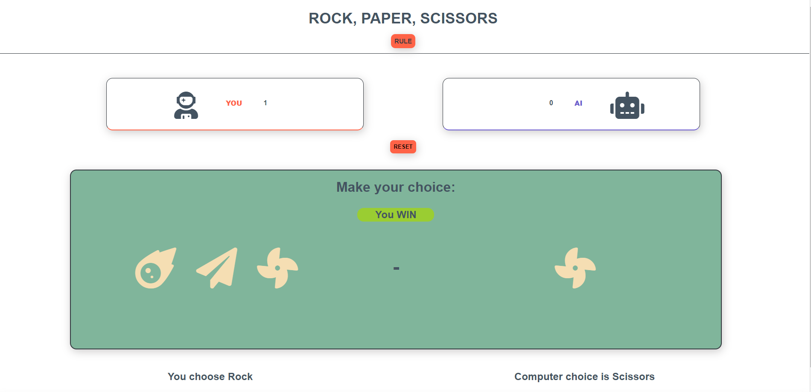
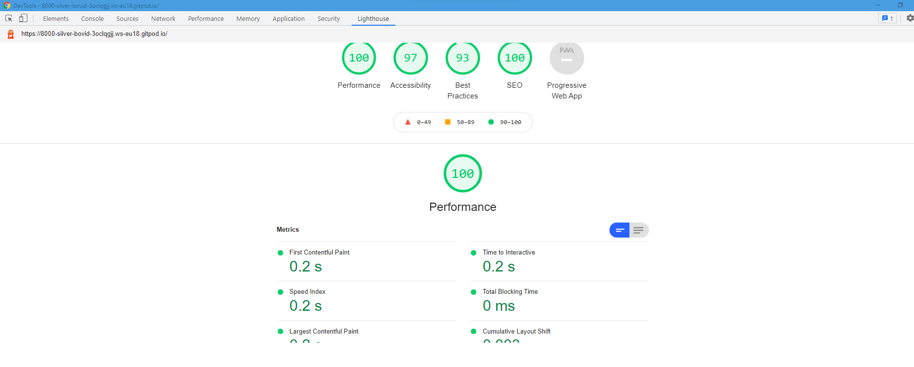
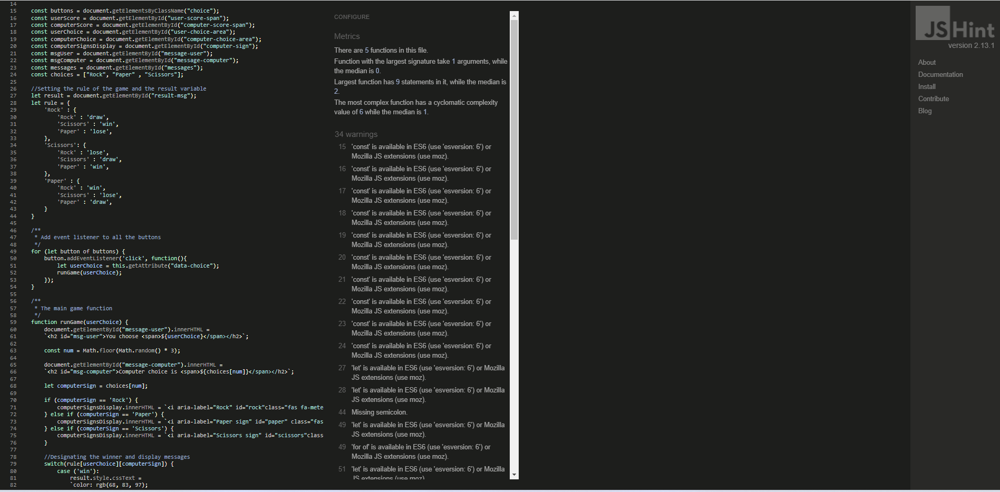

# Rock-Paper-Scissors game

## About

This game was built upon the real-life game where 2 people have a battle with gestures.
To make this even more fun, you now have the opportunity to play against the "AI" computer.
This game is and will always be based on luck to win. Try your luck and make the choice of how many rounds you want to play!

Give it a try!

[Click here to play the live game](https://kevindgnanih.github.io/Portfolio-2-Rock-Paper-Scissors/)

[To read more about the rules click here](https://en.wikipedia.org/wiki/Rock_paper_scissors#:~:text=A%20player%20who%20decides%20to,%22scissors%20cuts%20paper%22)

## User Experience 

Screenshot from [Am I Responsive](http://http://ami.responsivedesign.is/#)

- Game layout

    - The user will have the ability to play three "cards" gestures.
    - The score point in-game is linked to the rounds, for each win/round will increase the score.
    - Information regarding who won the round will appear on the screen.
    - The chosen sign by the computer will show up as soon as the user clicked his choice.
    - Extra written information at the bottom of the page regarding the selection of signs from both sides.

 

### Strategy

My strategy for the site was to provide content and ease of access to users who want to play a simple game and have fun by utilizing the key UX principles.
The website was made in a way to not overwelm the users with clean and ituitive information and navigation.

### Scope

In order to achieve the discovery and strategy goals, the following features were included in this release:

- Header to highlight the name of the game
- A button that is linked to the game's rule
- Two rectangles that shows information about the players
- A reset button that gives the user the chance to start the game from zero
- A head that indicate what to do and the result of the round
- Two sections that show the signs
- Two messages sections that appear after the user selected a sign
to informed in letters what signs have been selected from both competitors
- Footer that contains the copyright of the page

## Languages, Libraries and Programs

[HTML5](https://en.wikipedia.org/wiki/HTML5)
- Was used for the overall structure of the website.

[CSS3](https://en.wikipedia.org/wiki/Cascading_Style_Sheets)
- Was used for styling the elements and content on the website.

[Font Awesome](https://fontawesome.com/)
- Was used to have logos and signs.

[Javascript](https://en.wikipedia.org/wiki/JavaScript)
- Was used to code relevant responses to user actions, logic, and calculating.

[GitHub:](https://github.com/)
- GitHub was used to store the project's code after being pushed from Git.

[Gitpod:](https://www.gitpod.io/)
- Was used to develop and write my project.

## Testing

### Validator Testing : W3C and JSHint

Lighthouse is a feature of Google Chrome developer tools and is used to assess the performance of the website and its features.

I used the [W3C Markup Validation Service](https://validator.w3.org/) to check the Markup and [W3C CSS Validation Service](https://jigsaw.w3.org/css-validator/) to check the CSS
validity of the site.

I used JsHint to help me check to detect any errors and potential problems in my JavaScript code. 
[JsHint JavaScript Validator](https://jshint.com/)

### Unfixed bugs

- None

## Deployement

This website was published using GitHub Page. The steps are outlined below:
    - In the GitHub repository, navigate to the settings tab
    - From the source section drop-menu, select the Main branch
    - Once the main branch has been selected, the page was automatically refreshed 
    with a detailed ribbon, display to indicate the successful deployment.

    The live link can be found here - https://kevindgnanih.github.io/Portfolio-2-Rock-Paper-Scissors/

## Credits 

### Credits for the information and learning material I've used:

    - (https://www.w3schools.com)

### Media

The signs used for the game were taken from Font Awesome: (https://fontawesome.com/)

### Acknowledgments

I would like to thank my mentor [Guido Cecilio](https://github.com/guidocecilio) for his support and guidance throughout the course of this project.

Thank you!