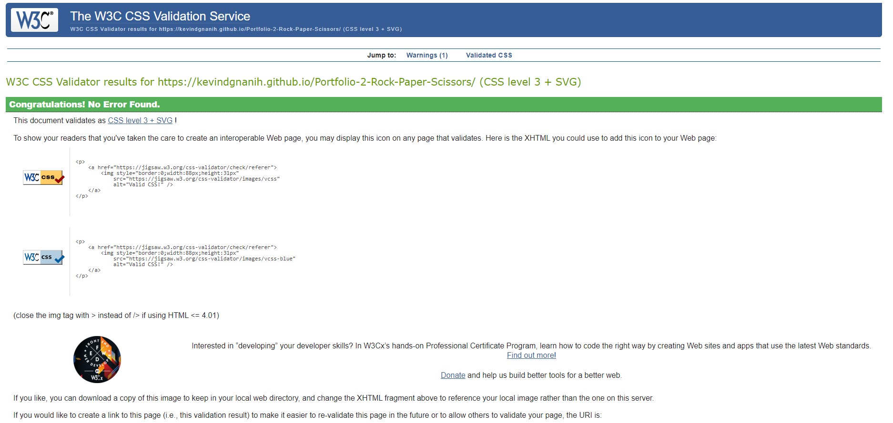

# Rock-Paper-Scissors game

## About

This game was build upon the real life game where 2 person have a battle with gestures.
To make this even more fun, you now have the opportunity to play against the "AI" computer.
This game is and will always be bases on luck to win. Try your luck and make the choice of how many rounds you want to play!

Give it a try!

[Click here to play the live game](https://kevindgnanih.github.io/Portfolio-2-Rock-Paper-Scissors/)

[To read more about the rules click here](https://en.wikipedia.org/wiki/Rock_paper_scissors#:~:text=A%20player%20who%20decides%20to,%22scissors%20cuts%20paper%22)

## User Experience 

Screenshot from [Am I Responsive](http://http://ami.responsivedesign.is/#)

- Game layout

    - The user will have the ability to play three "cards" gestures.
    - Thr score point in game is linked to the rounds, for eaxh win/round will increase the score.
    - Information regarding who won the round will appear on screen.
    - The chosen sign by the computer will show up as soon as the user clicked his choice.
    - Extra written information at the bottom of the page reagrding the selection of signs form both sides.

 

### Feature left to implement
In a near future I would like to implement:
- Sound effects
- Upgrade the UX

## Lamguages, Libraries and Programs

[HTML5](https://en.wikipedia.org/wiki/HTML5)
- Was used for the overall structure of the website.

[CSS3](https://en.wikipedia.org/wiki/Cascading_Style_Sheets)
- Was used for styling the elements and content on the website.

[Font Awesome](https://fontawesome.com/)
- Was used to have the logos and signs.

[Javascript](https://en.wikipedia.org/wiki/JavaScript)
- Was used for to code relevant responses to user actions, logics and calculating.

[GitHub:](https://github.com/)
- GitHub was used to store the projects code after being pushed from Git.

[Gitpod:](https://www.gitpod.io/)
- Was used to develop and write my project.

## Testing

### Validator Testing : W3C and JSHint

I used Lighthouse to audit the performance of the website:

### Unfixed bugs

- None

## Deployement

This website was published using GitHub Page. The steps are outlined below:
    - In GitHub repository, navigate to the settings tab
    - From the source section drop-menu, select the Main branch
    - Once the main branch has been selected, the page was autmatically refreshed 
    with a detailed ribbon display to indicate the seccessful deployment.

    The live link can be found here - https://kevindgnanih.github.io/Portfolio-2-Rock-Paper-Scissors/

## Credits 

### Credits for the information and learning material I've used:

    - (https://www.w3schools.com)

